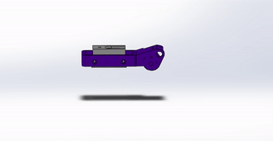

# Gelslight CAD Files

Files may only be opened in Solidworks 2019 and newer.

## 3D Print Files
* Colored Filament: `finger_gelsight_updated/finger_shell.sldprt`
* Colored Filament: `finger_gelsight_updated/shell_back.sldprt`
* Clear PLA: `finger_gelsight_updated/gelsight_corefilled_105.sldprt`

## Laser Cut Files
* Silicone: `finger_gelsight_production/gelsight_gelpattern_5x14.ai` 
* Acrylic: `finger_gelsight_production/gelsight_corefilled_acrylic.ai`

## Fabrication Tutorials

The instructions with pictures for fabricating the Gelslight sensors may be found [here](https://robotfeeding.io/hardware/gelsight-mini-tactile-sensor/)

The print-friendly wiki for fabricating Gelslight sensors may be found [here](https://github.com/personalrobotics/pr_docs/wiki/Gelsight-Mini-Sensor-Fabrication).

